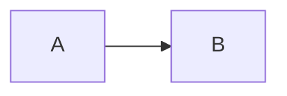
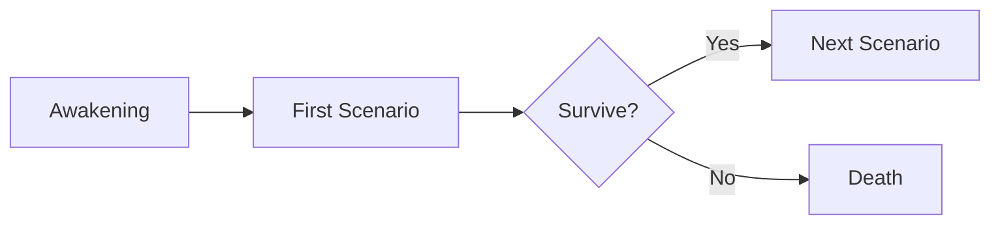

---
tags:
  - meta
---

# Style Guide

How to author pages for this wiki. This page also demonstrates every available
feature — use it as a copy-paste reference.

## Front matter & tags

Every page may start with YAML front matter. Tags feed the [Tags](tags.md) index.

```yaml
---
tags:
  - character
  - protagonist
---
```

## Cross-linking

Link between pages with **relative Markdown links** (the build validates them, so
broken links fail CI):

```markdown
[Example Location](locations/example-location.md)
[a character](characters/example-character.md)
```

Renders as: [Example Location](locations/example-location.md).

## System windows (admonitions / callouts)

Standard types — `note`, `tip`, `warning`, `danger`, `info`, `example`, `quote` —
all work. Plus five custom **System** flavors:

!!! system "SYSTEM"
    Use for in-world System messages and notifications.

!!! profile "PROFILE"
    Use for character / location / faction stat blocks.

!!! scenario "&lt;SCENARIO NAME&gt;"
    Use for quests, trials, and scenarios. Wrap the title in `&lt; &gt;`.

!!! reward "REWARD"
    Use for loot, coins, and prizes.

!!! penalty "PENALTY"
    Use for costs, punishments, and failure conditions.

Syntax:

```markdown
!!! scenario "<MAIN SCENARIO #1>"
    **CLEAR CONDITION:** ...
```

Collapsible variant with `???`:

??? note "Click to expand"
    Hidden content lives here.

## Tables

| FIELD | VALUE |
|-------|-------|
| Status | Alive |
| Rank | S |

## Content tabs

=== "Lore"
    The in-world explanation.

=== "Mechanics"
    The out-of-world rules.

## Diagrams (Mermaid)

````markdown

````

Renders as:



## Images

Embedded images support lightbox zoom (click to enlarge):

```markdown

```

Place image files under `docs/assets/` and reference them with relative paths.

## Code

```python
def clear_condition(targets: int) -> bool:
    return targets >= 1
```

## Footnotes

Reference a footnote like this.[^1]

[^1]: And define it at the bottom of the page.
